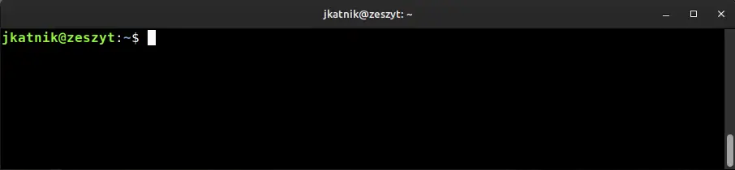

# AI-Bash

This project solves thefollowing problem:
> I love command line!
> Command line doesn't love me back. 
> It is a difficult relationship.

It uses OpenAI™ to turn user intention into the appropriate command, making it easier to interact with Bash or other shells.




## Installation
1. Clone this project `git clone git@github.com:jkatnik/ai-bash.git`
2. Register at https://beta.openai.com/signup
   and [create secret key](https://beta.openai.com/account/api-keys). Note it down. 
3. On Ubuntu-based distributions, for extra features, install `xdotool`
    ```
    apt install xdotool
    ```
4. run installation script
    ```
    ./install.sh
    ```
5. Reload shell
    ```
    source ~/.bashrc
    ```
6. have fun
    ```
    ai list files in my home folder 
    ```
## Usage

Basic usage:
```
$ ai list all text files in home dir
```

Reset conversation context and use new one
```
$ ai -n
```

Ask OpenAI a question
```bash
ai -q Who was the best soccer player ever?
```

If OpenAI™ fails, you can send the last question to google
```
$ ai -g
```

## Materials

- [Build an interactive CLI with Node.js by Hugo Dias](https://opensource.com/article/18/7/node-js-interactive-cli)
- [Build an interactive CLI application with Node.js by Chatthana Janethanakarn](https://medium.com/skilllane/build-an-interactive-cli-application-with-node-js-commander-inquirer-and-mongoose-76dc76c726b6)

## Reference
- [OpenAI JS client](https://github.com/openai/openai-node#readme)
- [why to use `npx link` instead of `npm link`](https://hirok.io/posts/avoid-npm-link)

## Development
Use Node 16 or higher.
```
nvm use v16
```

## Backlog
- configStore should check if newly entered API key is valid
- documentation
- prepare a blog post
- configure license
- provide OS and shell version in the prompt context
- -i information (version, file locations, node version, authors, etc)

## Ideas to consider

### Different way of passing command
Maybe we can use standard stdin command forward

Example:

Open terminal 1
```
$ echo $$
296
```
Open terminal 2
```
$ echo -n 'ls -la' >> /proc/296/fd/0
```
Then in the terminal 1 you will see command ls -la
