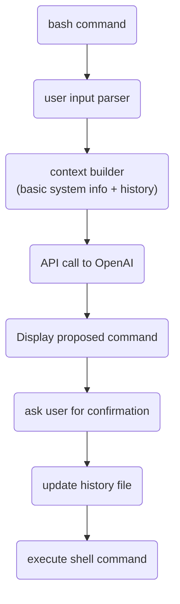

# AI-Shell

### I love bash. Bash doesn't love me back. It's a difficult relationship.

When I'm in the terminal I do exactly know what I want to achieve.
I usually know which commands I should use but if it is something more complex
than `rm -rf /` then I never recall the right syntax.

Since last few months everything revolves around ChatGTP.
I thought myself:
"Wouldn't it be cool if I could integrate Bash command line with OpenAI API?
But I'm just a poor soul with some Backend skills! I can't do C/Rust magic on Linux, and
I'd like to have it running on Mac too!"

Basicly I wanted to be able to write:
```bash
$ ai I kindly and humbly ask you to list all audio files in ~/tmp, recursively and grep by "2023-02-20"
```
and expected to do something similar to:
```
find /home/jkatnik/tmp -type f \( -name "*.wav" -o -name "*.mp3" -o -name "*.aac" -o -name "*.ogg" -o -name "*.flac" \) | grep 2023-02-20
```

I decided to "just do it" with all little resources I had. "Future generations will do it the right way" I said myself :)

I had at my disposal:
- basic knowledge of Bash, Node.js and TS
- a few colleagues from [ValueLogic](https://valuelogic.one)
- ChatGtp and GitHub Copilot
- old good Stackoverflow :D
- one afternoon

I decided to organize a hackathon to do some quick and dirty collective coding and more importantly to have an excuse
to extort free pizzas from the firm ;)


Here is what and how we did it.



The very i first, intentionally naive, approach was to simply take user input, make API call and execute response as terminal command.

OpenAI povides an [npm library](https://www.npmjs.com/package/openai) which is strightforward in use.

```bash
npm install openai
```

You will need an API key which can be obtained from the [profile page](https://platform.openai.com/account/api-keys).
Keys are automatically rotated from time to time.

```typescript
const oaiConfig = new oai.Configuration({
apiKey: configStore.getApiKey(),
});

const openAi = new oai.OpenAIApi(oaiConfig);
```

OpenAI provides several algorithms, each has its own characteristics and configurations. I found it convenient to play with [the playground](https://platform.openai.com/playground/p/default-text-to-command) first and then to copy settings.

## It's "Hello World" time!
A few lines of code are more worthy than a thousand words!

```Typescript
openAi.createCompletion({
    model: 'text-davinci-003',
    prompt: 'Print "Hello World" to Bash terminal',
    temperature: 0.1,
    max_tokens: tokensForResponse,
}).then(response => console.dir(response))
```
prints
```
dodać odpowiedź
```

Full parameters list is available in [documentation](https://....) and in the playground.

OpenAI is quite talkative by design. Generally I like it, as it is a learning opportunity but in this case such response
couldn't be used as bash command.

So, let's tell GTP about our intention:
```Typescript
openAi.createCompletion({
    model: 'text-davinci-003',
    prompt: 'I\'m on Linux Ubuntu 22. Write single bash command in one line. Nothing else! Print "Hello World"',
    temperature: 0.1,
    max_tokens: tokensForResponse,
}).then(response => console.dir(response))
```


That's all folks! I really admire you if you got so far in reading :)
You can give ai-shell a try, have some fun, maybe you will find it useful :)
Here is a [git repo](https://github.com/jkatnik/ai-shell), all
feedback is welcomed but please keep in mind (and have a mercy on me) that this
code wasn't intended to follow production-ready standards.
