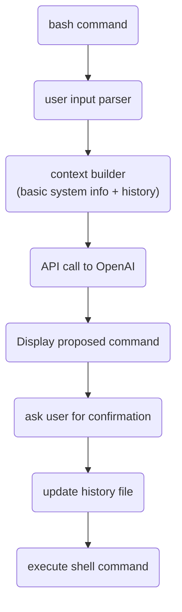

# AI-Shell

### I love bash. Bash doesn't love me back. It's a difficult relationship.

When I'm in the terminal I do exactly know what I want to achieve.
I usually know which commands I should use, but if it's something more complex
than `sudo rm -rf /`, then I never recall the right syntax 🤔.

For the past few months, everything revolves around ChatGPT.
I thought to myself:
"Wouldn't it be cool if I could integrate Bash command line with OpenAI API?
But I'm just a poor soul with some Backend skills! I can't do C/Rust magic on Linux, and
I'd like to have it running on Mac too!"

Basically, I wanted to be able to write:
```bash
$ ai I kindly and humbly ask you to list all audio files in ~/tmp, recursively and grep by "2023-02-20"
```
and expected to get something similar to:
```
find /home/jkatnik/tmp -type f \( -name "*.wav" -o -name "*.mp3" -o -name "*.aac" -o -name "*.ogg" -o -name "*.flac" \) | grep 2023-02-20
```

I decided to "just do it" with all the little resources I had. "Future generations will do it the right way" I said to myself 😆

I had at my disposal:
- basic knowledge of Bash, Node.js and TS
- a few colleagues from [ValueLogic](https://valuelogic.one)
- ChatGpt, GitHub Copilot and old good Stackoverflow 😁
- one afternoon

I decided to organize a hackathon to do some quick and dirty collective coding and, more importantly, to have an excuse
to extort free pizzas from the firm 🍕😉


Here is what and how we did it.



The very first, intentionally naive, approach was to simply take user input, make an API call, and execute the response as a shell command.

OpenAI provides an [npm library](https://www.npmjs.com/package/openai) which is very straightforward to use.

```bash
npm install openai
```

You will need an API key, which can be obtained from the [profile page](https://platform.openai.com/account/api-keys).
Keys are automatically rotated from time to time.

```typescript
const oaiConfig = new oai.Configuration({
apiKey: configStore.getApiKey(),
});

const openAi = new oai.OpenAIApi(oaiConfig);
```

OpenAI provides several algorithms, each has its own characteristics and configurations.
I found it convenient to play with [the playground](https://platform.openai.com/playground/p/default-text-to-command) first and then copy settings.

## It's "Hello World" time!
A few lines of code are more worthy than a thousand words!

```Typescript
openAi.createChatCompletion({
    model: 'gpt-3.5-turbo',
    messages: [
        {
            role: "user",
            content: 'Print "Hello World" to Bash terminal'
        }
    ],
    temperature: 0.1,
    max_tokens: tokensForResponse,
}).then(response => console.dir(response.data.choices[0].message.content))
```
prints
```
To print "Hello World" to the Bash terminal, simply type the following command and press enter:

echo "Hello World"

This will output "Hello World" to the terminal.
```

Full parameters list is available in [documentation](https://....) and in the playground.

OpenAI is quite talkative by design. Generally I like it, as it is a learning opportunity, but in this case, such a response
couldn't be used as bash command.

So, let's tell GPT about our intention:
```Typescript
openAi.createChatCompletion({
    model: 'gpt-3.5-turbo',
    messages: [{
        role: 'user',
        content: 'I\'m on Linux Ubuntu 22. Write single bash command in one line. Nothing else! Print "Hello World"'
    }],
    temperature: 0.1,
    max_tokens: tokensForResponse,
}).then(response => console.dir(response))
```

In fact "I'm on Linux Ubuntu 22" gives some very basic, yet useful context to GPT.

The richer the context, the better GPT performs. It returns more accurate commands.
The context allows interaction with OpenAI as it were a conversation between humans.

```bash
$ ai list audio files in curr dir

ls *.mp3 *.wav *.aac *.flac

$ ai silly me, I meant video files

ls *.mp4 *.avi *.mov *.mkv

$ ai more formats

ls *.mp4 *.avi *.mov *.mkv *.wmv *.flv *.3gp *.mpeg *.ogv *.webm
```

Unfortunately, OpenAI doesn't store context on the server side (yet). It must be build and sent with every request.
How to do it? Well, simply store conversation history and send it in each time. **But** there is a limitation!
Version 3.x has limit of 4000 tokens. That means that you cannot pass whole (potentially very long) interaction history.
Tokens limit (charging) applies to both the request and response combined.
In request, you can specify your expected maximum response length in tokens and use rest of them for the context.
Now, you are probably wondering what those tokens are 🙂
Basically, GPT splits the text into small string chunks, usually [3-4 letters long](https://help.openai.com/en/articles/4936856-what-are-tokens-and-how-to-count-them) - they call it a token.
Sometimes a token can be just one character, sometimes even six.

Let's say that you allocate 200 tokens for response, so you have 3800 tokens left for your query.
But how to build the context that fits this limit when token definition is so vague?
Fortunately, there is [a handy library](https://www.npmjs.com/package/gpt-3-encoder) that can do that.

```bash
npm install gpt-3-encoder
```

It's super simple (so I like it) 😄
```typescript
import { encode } from 'gpt-3-encoder';
const countTokens = (question: string) => encode(question).length;
```

Now we can traverse conversation history backwards, calculate if history entry still fits in the limit, and if it does, add it to the context.
If not, then the context is ready.

```typescript
export const buildContext = (freeTokens: number): string => {
  let context = '';
  let usedTokens = 0;
  const history = loadHistory().map((entry) => entry.text);

  while (usedTokens < freeTokens && history.length > 0) {
    const entry = `${history.shift()}\n\n`;
    const tokens = countTokens(entry);
    if (usedTokens + tokens < freeTokens) {
      context += entry;
      usedTokens += tokens;
    }
  }
  return context;
};
```

### Cool use-cases

#### AWS cli
As a Java/Kotlin Backend developer, I work with AWS a lot. Generally, we follow
infrastructure-as-a-code approach, but from time-to-time I need to check something or
adjust some settings on a testing environment. Working with the AWS console is tedious, slow and
error-prone. I prefer AWS CLI, however its syntax is a big pain in the ... back.
`ai-shell` for the rescue:

```bash
$ ai list all SNS topics and grep them by 'sandbox'

AI: aws sns list-topics | jq -r '.Topics[].TopicArn' | grep sandbox

✔ What to do? › Execute
arn:aws:sns:eu-west-1:000000000000:aurora-sandbox-relocation-request-stream-topic
arn:aws:sns:eu-west-1:000000000000:is24-relocation-gdpr-adapter-sandbox-gdpr-information-requests-alarming
arn:aws:sns:eu-west-1:000000000000:is24-ufc-sandbox-app-notificationTopic-VJ9WOX3Z489E
arn:aws:sns:eu-west-1:000000000000:is24-ufc-sandbox-db-MonitoringTopic-9Q992QEBPC0X-rds-topic
arn:aws:sns:eu-west-1:000000000000:mta2restmailer-app-sandbox-notificationTopic-1MND6VFU1Y2Y7
arn:aws:sns:eu-west-1:000000000000:relocation-request-compare-id-compare-sandbox
```

### GIT command line
I never mastered its syntax in details.

```bash
$ ai list my remote branches

AI: git branch -r | grep $(whoami)

✔ What to do? › Execute
  origin/jkatnik/R2UE-339-lead-generation-poc
  origin/jkatnik/fix-postal-code-length
  origin/jkatnik/security-fix
```

#### FFMPEG
Once, I had to convert a batch of old cartoons to a more modern file format.
I could spend quite some time reading about which video editor to use, then learning how to
use it, and finally converting those files. Instead, I used GPT.
```bash
$ai convert files from /home/jkatnik/media/kids/gummibears to some modern format with decent quality

AI: for file in /home/jkatnik/media/kids/gummibears/*.mp4; do ffmpeg -i "$file" -c:v libx264 -preset slow -crf 22 -c:a aac -b:a 128k /home/jkatnik/media/kids/gummibears/new_format/"${file##*/}"; done
```


That's all folks! I really admire you if you got so far in reading 🙂

You can give ai-shell a try, have some fun, and maybe you will find it useful 🙂
Here is [the git repo](https://github.com/jkatnik/ai-shell), all feedback is
welcomed, but please, have mercy on me - it wasn't intended to be a production-quality 😁

P.S.
Although writing the entire script took me a few evenings in total, I spent a lot of time on this post.
In the meantime (yesterday), GitHub announced a new product - Copilot X, which will have essentially the same tool.

Proofreading by ChatGPT 4.0 - so you'll know who to blame for all mistakes :P