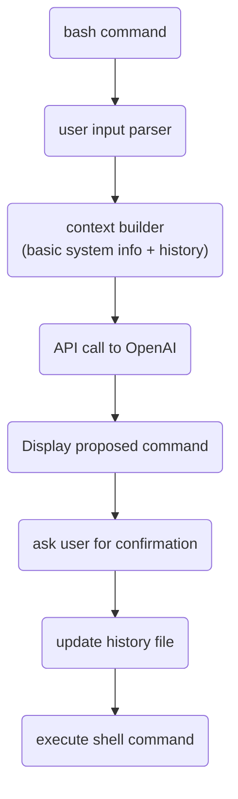

# AI-Shell

### I love bash. Bash doesn't love me back. It's a difficult relationship.

When I'm in the terminal I do exactly know what I want to achieve.
I usually know which commands I should use but if it is something more complex
than `sudo rm -rf /` then I never recall the right syntax.

Since last few months everything revolves around ChatGTP.
I thought myself:
"Wouldn't it be cool if I could integrate Bash command line with OpenAI API?
But I'm just a poor soul with some Backend skills! I can't do C/Rust magic on Linux, and
I'd like to have it running on Mac too!"

Basicly I wanted to be able to write:
```bash
$ ai I kindly and humbly ask you to list all audio files in ~/tmp, recursively and grep by "2023-02-20"
```
and expected to get something similar to:
```
find /home/jkatnik/tmp -type f \( -name "*.wav" -o -name "*.mp3" -o -name "*.aac" -o -name "*.ogg" -o -name "*.flac" \) | grep 2023-02-20
```

I decided to "just do it" with all little resources I had. "Future generations will do it the right way" I said myself :)

I had at my disposal:
- basic knowledge of Bash, Node.js and TS
- a few colleagues from [ValueLogic](https://valuelogic.one)
- ChatGtp and GitHub Copilot and old good Stackoverflow :D
- one afternoon

I decided to organize a hackathon to do some quick and dirty collective coding and more importantly to have an excuse
to extort free pizzas from the firm ;)


Here is what and how we did it.



The very first, intentionally naive, approach was to simply take user input, make API call and execute response as a shell command.

OpenAI provides an [npm library](https://www.npmjs.com/package/openai) which is very straightforward in use.

```bash
npm install openai
```

You will need an API key which can be obtained from the [profile page](https://platform.openai.com/account/api-keys).
Keys are automatically rotated from the time to time.

```typescript
const oaiConfig = new oai.Configuration({
apiKey: configStore.getApiKey(),
});

const openAi = new oai.OpenAIApi(oaiConfig);
```

OpenAI provides several algorithms, each has its own characteristics and configurations. I found it convenient to play with [the playground](https://platform.openai.com/playground/p/default-text-to-command) first and then to copy settings.

## It's "Hello World" time!
A few lines of code are more worthy than a thousand words!

```Typescript
openAi.createCompletion({
    model: 'text-davinci-003',
    prompt: 'Print "Hello World" to Bash terminal',
    temperature: 0.1,
    max_tokens: tokensForResponse,
}).then(response => console.dir(response))
```
prints
```
dodać odpowiedź
```

Full parameters list is available in [documentation](https://....) and in the playground.

OpenAI is quite talkative by design. Generally I like it, as it is a learning opportunity but in this case such response
couldn't be used as bash command.

So, let's tell GTP about our intention:
```Typescript
openAi.createCompletion({
    model: 'text-davinci-003',
    prompt: 'I\'m on Linux Ubuntu 22. Write single bash command in one line. Nothing else! Print "Hello World"',
    temperature: 0.1,
    max_tokens: tokensForResponse,
}).then(response => console.dir(response))
```

In fact "I'm on Linux Ubuntu 22" gives some very basic, yet useful context to GTP.

The richer context is the GPT performs better, it returns more accurate commands. The context allows to interact with OpenAI as it would be a conversation between humans.

```bash
$ ai list audio files in curr dir

ls *.mp3 *.wav *.aac *.flac

$ ai silly me, I meant video files

ls *.mp4 *.avi *.mov *.mkv

$ ai more formats

ls *.mp4 *.avi *.mov *.mkv *.wmv *.flv *.3gp *.mpeg *.ogv *.webm
```

Unfortunatelly, OpenAI doesn't store context on the server side. It must be build and sent with every request. How to do it? Well, simply store queries history and send them in each time. **But** there is a limitation! Free/preview version has limit of 4000 tokens. Paid version well, is ... paid ;) That means that you cannot pass whole (potentially very long) interaction history.
Tokens limit (charging) is applied to request and response combined together. In request you can tell what is your expecxted maximum reponse length in tokens and use rest of them for the context. Now, you are porobably wondering what those tokens are :) Basicly, GTP splits the text into small string chunks, usually [3-4 letters long](https://help.openai.com/en/articles/4936856-what-are-tokens-and-how-to-count-them) - they call it the token. Somtimes token can be just one character, sometimes even 6.

Let's say that you allocate 200 tokens for response, so you have 3800 tokens left for your query. But how to build the contenxt that fits this limit when token definition is so vague?
Fortunatelly there is [a handy library](https://www.npmjs.com/package/gpt-3-encoder) that can do that.

```bash
npm install gpt-3-encoder
```

It is super simple (so I like it) :D
```typescript
import { encode } from 'gpt-3-encoder';
const countTokens = (question: string) => encode(question).length;
```

Now we can traverse conversation history backwards, calculate if history entry still fits in the limit. If does - then it should be added to the context. If not then context is ready.

```typescript
export const buildContext = (freeTokens: number): string => {
  let context = '';
  let usedTokens = 0;
  const history = loadHistory().map((entry) => entry.text);

  while (usedTokens < freeTokens && history.length > 0) {
    const entry = `${history.shift()}\n\n`;
    const tokens = countTokens(entry);
    if (usedTokens + tokens < freeTokens) {
      context += entry;
      usedTokens += tokens;
    }
  }
  return context;
};
```

### Cool use-cases

#### AWS cli
As a Java/Kotlin Backend developer I work with AWS a lot. Generally we follow
infrastructure as a code approach but from time-to-time I need to check sth or
adjust some settings on test env. Working with AWS console is tedious, slow and
error-prone. I prefer AWS CLI, however its syntax is a big pain in the ... back.
`ai-shell` for the rescue:

```bash
ai list all SNS topic names and grep them by 'sandbox'

TODO wstawić wynik
```

```bash
ai disable all KMS keys without key rotation enabled
TODO wstawić wynik, sprawdzić czy to był ten case
```

#### FFMPEG
Once I had to convert a batch of old cartoons to more modern file formats.
I could spend quite a time on reading which video editor to use, then to
learn how to use it and finally to convert those file, instead I used GTP.
```bash
$ ai convert files from ~/media/kids/gummiebears to some modern format with decent quality
TODO podać output
```


That's all folks! I really admire you if you got so far in reading :)

You can give ai-shell a try, have some fun, maybe you will find it useful :)
Here is [a git repo](https://github.com/jkatnik/ai-shell), all feedback is
welcomed but please, have a mercy on me - it' wasn't intended to be a production-quality :D
